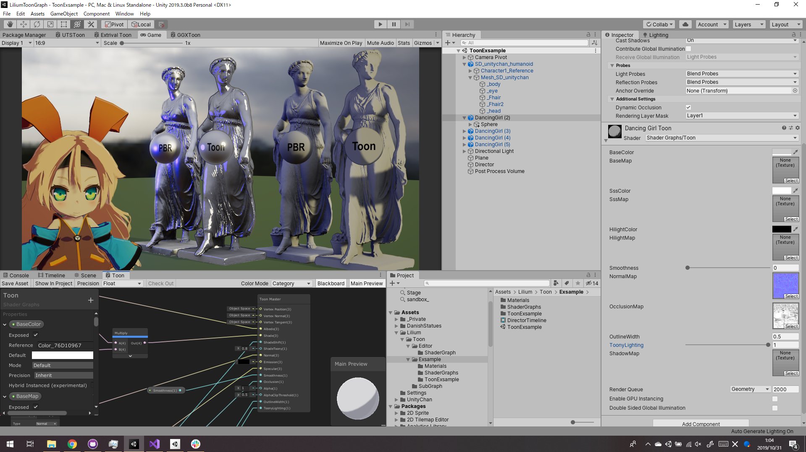

# LiliumToonGraph

トゥーンシェーダーでもシェーダーグラフを使いたい！

+ LWRP 専用トゥーンシェーダーです。
+ ShaderGraphパッケージ内のInternalクラスを利用します。前方互換性は低いと思われます。
+ スペキュラ表現にはまだ対応していません。絶賛対応中です。
+ PBRマスターノードを改造する形で開発しました。まだ無駄なコードが残っています。
+ HDRP 対応もできたらいいな。
+ まだまだ開発中です。仕様変更も多いにあります。
+ カスタムマスターノードのサンプルにどうぞ。

## System requirements

+ Unity 2019.1.0b7
+ Windows: Direct3D 11 support

## How to use

### Exsample Scene
Assets/Lilium/Toon/ToonExsample.unity

### Create toon shader graph
1. Projectウインドウで右クリック
2. Create > Shader > Toon Graph を選択

## Licenses

MIT

"Assets/UnityChan" and "Assets/UnityHDRI" Folders License below to their licenses.
